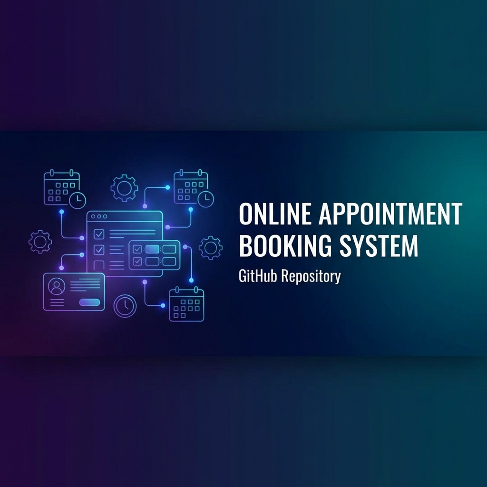

# 📅 Sistema de Citas Online

Sistema completo para gestión de citas y reservaciones. Ideal para consultorios médicos, dentales, estéticas, y cualquier negocio que maneje citas.


## ✨ Características

- 🗓️ **Reservación online 24/7** - Clientes agendan sin llamar
- 📱 **100% Responsive** - Funciona en móvil y desktop
- ⚡ **Confirmación instantánea** - Sin esperas
- 🔧 **Multi-servicio** - Define servicios con precios y duración
- 📊 **Panel de administración** - Gestiona todas las citas
- 🚫 **Prevención de doble reserva** - Sistema inteligente de slots

## 🚀 Demo Rápido

```bash
# Clonar repositorio
git clone https://github.com/270803ggiztheking-rgb/citas-online.git
cd citas-online

# Instalar dependencias
pip install -r requirements.txt

# Iniciar servidor
uvicorn src.main:app --reload

# Abrir navegador
# http://localhost:8000
```

## 📖 Uso

### 1. Crear Demo

Visita `http://localhost:8000` y haz clic en "Crear Demo" para generar un consultorio de ejemplo.

### 2. Agendar Cita

Navega a `/book/demo-consultorio` para probar el flujo de reservación.

### 3. API Endpoints

| Método | Endpoint | Descripción |
|--------|----------|-------------|
| POST | `/api/businesses` | Crear negocio |
| GET | `/api/businesses/{id}/services` | Listar servicios |
| GET | `/api/businesses/{id}/available-times` | Horarios disponibles |
| POST | `/api/businesses/{id}/appointments` | Crear cita |
| GET | `/api/businesses/{id}/appointments` | Listar citas |

## 🏗️ Estructura

```
citas-online/
├── src/
│   └── main.py          # FastAPI application
├── templates/
│   ├── index.html       # Landing page
│   └── booking.html     # Booking interface
├── static/
│   └── css/
│       └── styles.css   # Styles
├── requirements.txt
└── README.md
```

## 💼 Casos de Uso

- **Consultorios médicos** - Citas con doctores
- **Dentistas** - Agendar tratamientos
- **Estéticas/Spa** - Reservar servicios
- **Barberías** - Turnos de corte
- **Consultorías** - Asesorías profesionales

## 🛠️ Personalización

El sistema es fácilmente personalizable:

- Modifica `static/css/styles.css` para cambiar colores/diseño
- Edita `templates/` para agregar logo y branding
- Usa la API para integrar con tu software existente

## 📄 Licencia

MIT License

## 👤 Autor

**Gael L. Chulim G.**  
Freelance Developer & Automation Specialist  
[LinkedIn](https://www.linkedin.com/in/gael-chulim) | [GitHub](https://github.com/270803ggiztheking-rgb)

---

¿Necesitas este sistema para tu negocio? **Contáctame para una implementación personalizada.**
